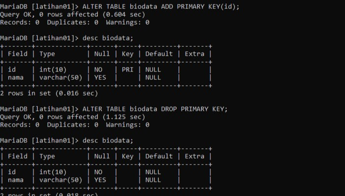

# Project-Basis-Data-1
~~~sh

Membuka mysql client

# mysql -u root

CREATE DATABASE (Nama_Database)

Perintah: USE

USE latihan01;

Menampilkan daftar Basis data 

SHOW DATABASE;

Membuat Tabel

CREATE TABLE biodata VARCHAR(50), alamat TEXT);

Menampilkan Sturktur Tabel

DESC (nama_tabel)

Menambah Field

ALTER TABLE Biodata ADD COLUMN id int (10) FIRST;

Mengubah Nama Field

ALTER TABLE biodata CHANGE alamat alamat_jalan VARCHAR(200);

Mengubah Tipe Data

ALTER TABLE biodata MODIFY alamat_jalan TINYTEXT;

Menghapus Field

ALTER TABLE biodata DROP alamat_text;

Menambahkan Index atau Key

ALTER TABLE biodata ADD PRIMARY KEY(id);

Menghapus Primary Key

ALTER TABLE biodata DROP PRIMARY KEY;

Mengubah nama Field

ALTER TABLE data_mhs rename biodata;

Contoh Gambar:

 1.  
 2.  
 3.  
 4.  
 5.  
 6.  
 7.  
 8.  
 9.  
 10. 
 11. 

 ~~~
